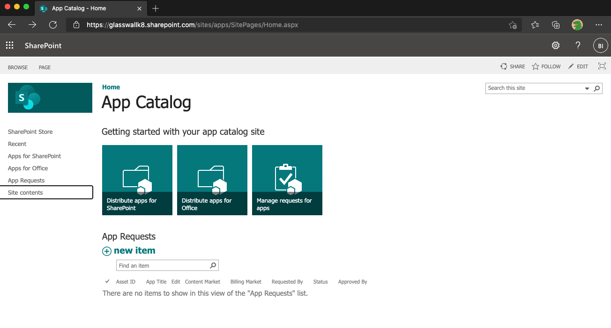
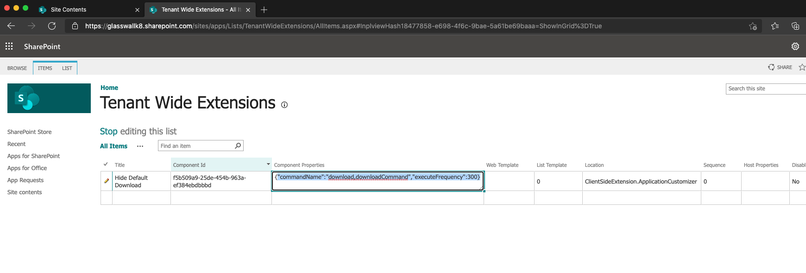

## GW SPO Extension Administration

### Configure Hide Download Extension Solution
SharePoint Online keeps tenant-wide extension details in a List called, "Tenant Wide Extensions" on App Catalog Site.
For Hide-Download-Extension, we keep following two properties which can be configured:
    1. CommandName: This is the comma separated values of all the possible values of attribute 'data-automationid' of HTML controls. We use it to track the download button on the page.
    2. ExecuteFrequency: The is numeric value which defines the frequency interval at which the extension checks for download buttons on page and hides it.

### Steps to update Hide Download Extension Properties
The default values are already configured however if we would like to customize, we can update them as follows:
- Navigate to App Catalog Site on your tenant (i.e. https://{tenant}.sharepoint.com/sites/apps).
- Click on 'Site contents' in the Left Navigation.

- Click on 'Tenant Wide Extensions' List.

- Edit the item with title, 'Hide Default Download'.

- You can make changes in the field called "Component Properties" to update extension properties. 

- Make sure you ONLY update highlighted values as follows and keep the JSON format as it is:
    * {"commandName":"<b><i>download,downloadCommand</i></b>","executeFrequency":<b><i>300</i></b>}
  
- Please note that the changes to the list will be applied to the extension on your tenant in 2 to 24 hours.

## FileHandler Administration
In order to update settings below:

1. AzureAd:ClientId - Client Id of the App registered with Azure Active Directory 
2. AzureAd:ClientSecret - Client Secret created in App registered with Azure Active Directory 
3. AzureAd:Domain - Domain of your O365 subscription. For e.g. glasswall.onmicrosoft.com.
4. AzureAd:TenantId - Tenant id of your Azure Active Directory tenant.  
5. Glasswall:BaseUrl - Base url of your Glasswall GW Cloud SDK endpoint. For e.g. https://glasswall.execute-api.us-west-2.amazonaws.com/Prod/rebuild/api
6. Glasswall:ApiKey - Api Key to access the Glasswall GW Cloud SDK.

- Option 1: Edit the [appsettings.json file](https://github.com/k8-proxy/gp-sharepoint-plugins/blob/main/Online/glasswall.o365.filehandler/Net5/src/FileHandler/src/Glasswall.O365.FileHandler.App/appsettings.json) on your web app source code and redeply the app.

- Option 2: Manually edit the [appsettings.json file](https://github.com/k8-proxy/gp-sharepoint-plugins/blob/main/Online/glasswall.o365.filehandler/Net5/src/FileHandler/src/Glasswall.O365.FileHandler.App/appsettings.json) on your deployed web app.
  
- Option 3: Use your cloud service configuration editor UI to update the relevant properties 
- Doc for [azure](https://docs.microsoft.com/en-us/azure/app-service/configure-common)

## Resources

