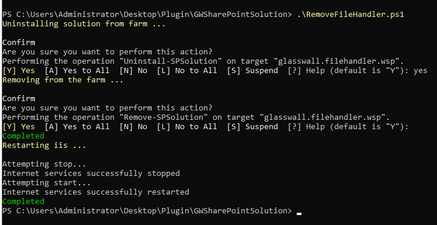

## Overview

The Sharepoint Server plugin allows to delegate all download and uploads activities in the SharePoint User Interface to the GlassWall Rebuild engine. This keeps the all sharepoint documents safe.

## Removing File Handler Plugin

1. To remove the File Handler, firstly, we need to identify whether the application plugin has been installed on the machine or not. To identify the installation status, Open SharePoint 2019 Management Shell and run: `Get-SPSolution`

2. If the output prompt looks like below, Glasswall.FileHandler.wsp has been installed. Else, we don't have any Glasswall.FileHandler.wsp installed.

3. For the removal of this plugin open SharePoint 2019 Management Shell (as Administrator) and navigate where *RemoveFileHandler.ps1* and run the file. When prompted `Are you sure you want to perform this action?` type "YES". You should get the below output:

4. If the error 'PSSECURITYEXCEPTION' occurs, then do as below:
    - With PowerShell, run `Get-ExecutionPolicy` and inssure that it is set correctly (not Restrected or Reserved). 
    - Use Bypass to bypass the policy to get things installed or AllSigned for quite a bit more secure. Run `Set-ExecutionPolicy AllSigned` and/or `Set-ExecutionPolicy Bypass -Scope Process`.
    - Click [here](https://go.microsoft.com/fwlink/?LinkID=135170) for more information.

5. Once, the cmdlet ran successfully, validate the SharePoint Plugin running `Get-SPSolution`. This time it should not prompt any output.

#### Resources
- [Watch the video](../../../../static/video/docs/websites/sharepoint/server/SharePoint-Server-Installation.mp4)
